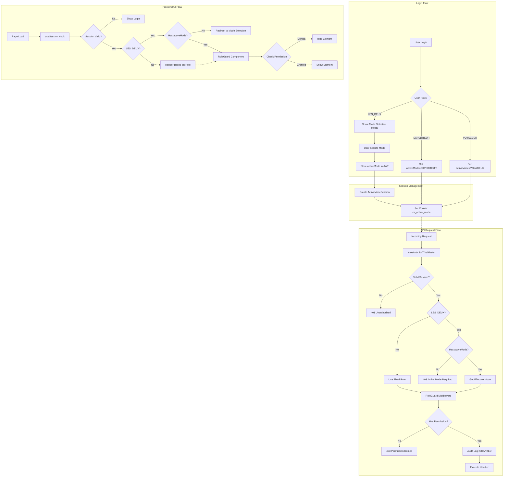
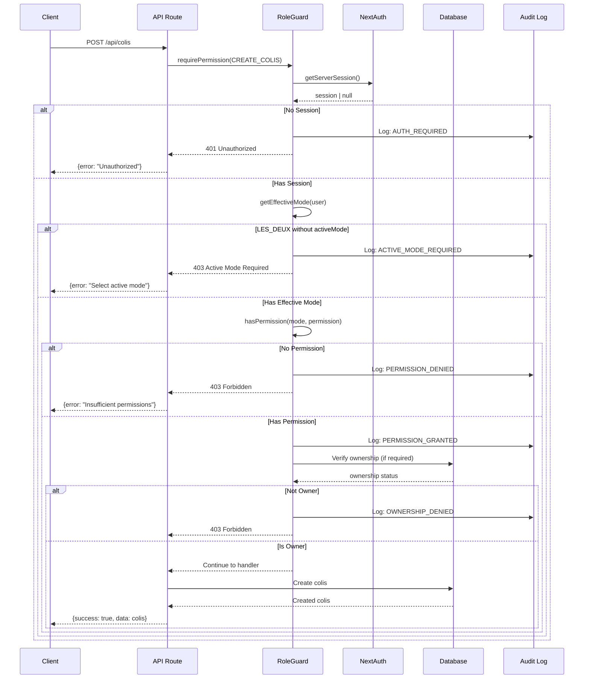
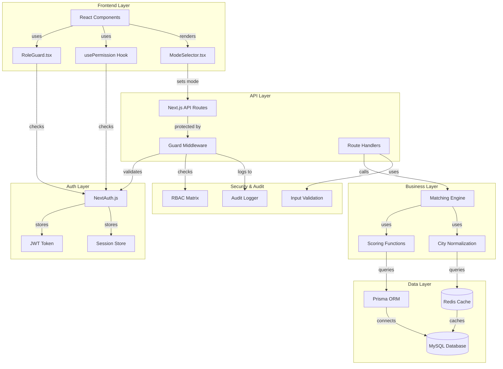
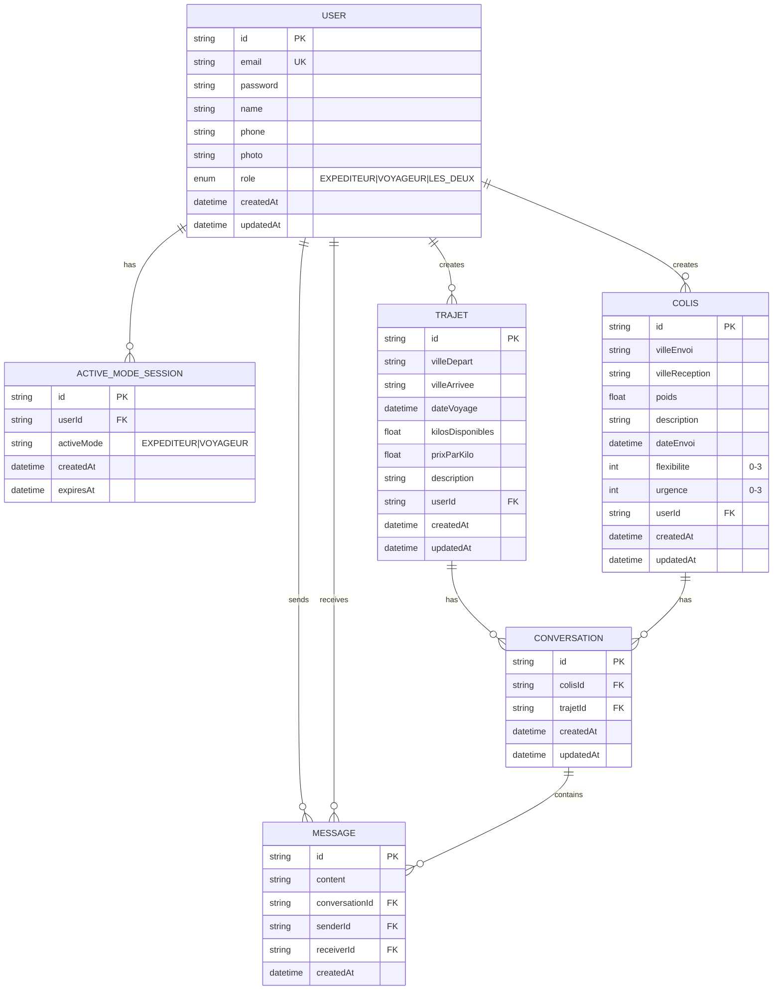
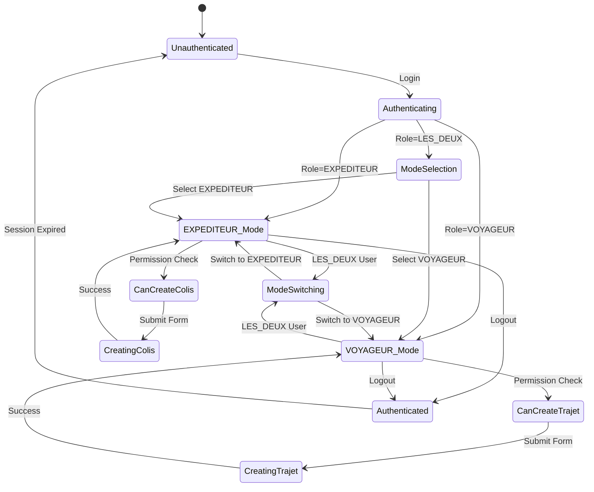
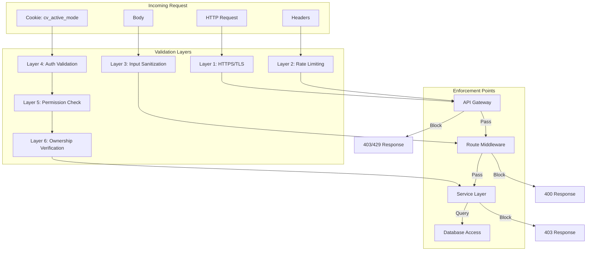

# Architecture Diagrams

## 1. Active Mode Flow Architecture



## 2. Permission Check Sequence



## 3. Matching Algorithm Flow

```mermaid
flowchart TD
    subgraph Input["Input Validation"]
        A[calculateMatch] --> B[Validate Inputs]
        B --> C{Valid?}
        C -->|No| D[Throw ValidationError]
        C -->|Yes| E[Extract colis & trajet]
    end

    subgraph Primary["Primary Criteria (70 pts)"]
        E --> F[Calculate Departure Score]
        F --> G[Calculate Arrival Score]
        G --> H[Calculate Date Score]
        H --> I[Sum: primaryTotal]
    end

    subgraph Secondary["Secondary Criteria (30 pts)"]
        I --> J[Calculate Weight Score]
        J --> K[Calculate Flexibility Score]
        K --> L[Calculate Urgency Score]
        L --> M[Sum: secondaryTotal]
    end

    subgraph Guarantee["Guarantee Check"]
        M --> N[rawScore = primary + secondary]
        N --> O{All Primary Exact?}
        O -->|Yes| P[guaranteedScore = max(rawScore, 70)]
        O -->|No| Q[guaranteedScore = rawScore]
    end

    subgraph Output["Result Construction"]
        P --> R[Build Breakdown Object]
        Q --> R
        R --> S[Classify Match]
        S --> T[Return MatchResult]
    end

    D --> U[Error Boundary]
```

## 4. System Architecture Overview



## 5. Database Schema Changes



## 6. Mode Switching Flow



## 7. Matching Score Calculation

```mermaid
flowchart LR
    subgraph Primary["Primary Criteria (70%)"]
        direction TB
        D[Departure<br/>25 pts]
        A[Arrival<br/>25 pts]
        DT[Date<br/>20 pts]
    end

    subgraph Secondary["Secondary Criteria (30%)"]
        direction TB
        W[Weight<br/>15 pts]
        F[Flexibility<br/>10 pts]
        U[Urgency<br/>5 pts]
    end

    subgraph Formula["Scoring Formula"]
        SUM[SUM = D + A + DT + W + F + U]
        GUAR{Exact Primary<br/>Match?}
        FINAL[Final Score = max(SUM, 70)]
        RAW[Final Score = SUM]
    end

    D --> SUM
    A --> SUM
    DT --> SUM
    W --> SUM
    F --> SUM
    U --> SUM

    SUM --> GUAR
    GUAR -->|Yes| FINAL
    GUAR -->|No| RAW
```

## 8. Security Layer Architecture


