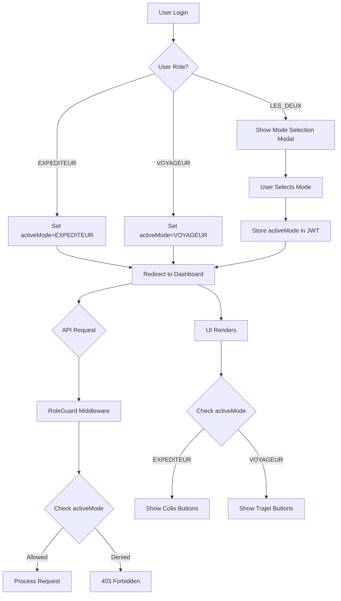

# Architecture: RBAC System & Matching Algorithm

## Executive Summary

This document defines the corrected architecture for the Colis Voyageurs platform, addressing critical security flaws in the current RBAC system and implementing a proper scoring-based matching algorithm.

---

## Part 1: Role-Based Access Control (RBAC) System

### 1.1 Current Problems Identified

| Issue | Severity | Description |
|-------|----------|-------------|
| No role validation on API routes | **CRITICAL** | [`trajets/route.ts`](src/app/api/trajets/route.ts:17) only checks authentication, not role |
| No "active mode" system | **CRITICAL** | `LES_DEUX` users can perform both actions simultaneously |
| Default role is BOTH | **HIGH** | New users get full permissions by default |
| Frontend shows all buttons | **MEDIUM** | UI doesn't filter based on active mode |
| No permission middleware | **HIGH** | Each route must manually implement checks |

### 1.2 Role Definitions

```typescript
// Core role enum - stored in database
enum UserRole {
  EXPEDITEUR = 'EXPEDITEUR',    // Can only send packages
  VOYAGEUR = 'VOYAGEUR',        // Can only offer trips
  LES_DEUX = 'LES_DEUX'         // Must choose active mode at login
}

// Active mode - determines current permissions
enum ActiveMode {
  EXPEDITEUR = 'EXPEDITEUR',
  VOYAGEUR = 'VOYAGEUR'
}

// Permission actions
enum Permission {
  CREATE_COLIS = 'CREATE_COLIS',
  CREATE_TRAJET = 'CREATE_TRAJET',
  VIEW_COLIS = 'VIEW_COLIS',
  VIEW_TRAJETS = 'VIEW_TRAJETS',
  CONTACT_VOYAGEUR = 'CONTACT_VOYAGEUR',
  CONTACT_EXPEDITEUR = 'CONTACT_EXPEDITEUR'
}
```

### 1.3 Permission Matrix

| Role | Active Mode | CREATE_COLIS | CREATE_TRAJET | VIEW_COLIS | VIEW_TRAJETS | CONTACT |
|------|-------------|--------------|---------------|------------|--------------|---------|
| EXPEDITEUR | N/A | ✅ | ❌ | ✅ | ✅ | ✅ (as sender) |
| VOYAGEUR | N/A | ❌ | ✅ | ✅ | ✅ | ✅ (as carrier) |
| LES_DEUX | EXPEDITEUR | ✅ | ❌ | ✅ | ✅ | ✅ (as sender) |
| LES_DEUX | VOYAGEUR | ❌ | ✅ | ✅ | ✅ | ✅ (as carrier) |

**CRITICAL RULE**: LES_DEUX users MUST select an active mode at login. Permissions are determined SOLELY by active mode, never cumulative.

### 1.4 Data Model Changes

#### Prisma Schema Updates

```prisma
// Add to schema.prisma
enum UserRole {
  EXPEDITEUR
  VOYAGEUR
  LES_DEUX
}

model User {
  id            String    @id @default(cuid())
  email         String    @unique
  password      String
  name          String
  phone         String?
  photo         String?
  role          UserRole  @default(EXPEDITEUR)  // CHANGED: No more BOTH default
  createdAt     DateTime  @default(now())
  updatedAt     DateTime  @updatedAt

  // Relations
  trajets       Trajet[]
  colis         Colis[]
  sentMessages  Message[] @relation("SentMessages")
  receivedMessages Message[] @relation("ReceivedMessages")

  @@map("users")
}

// Add ActiveModeSession for tracking mode switches
model ActiveModeSession {
  id        String   @id @default(cuid())
  userId    String
  activeMode String   // EXPEDITEUR or VOYAGEUR
  createdAt DateTime @default(now())
  expiresAt DateTime

  @@index([userId])
  @@map("active_mode_sessions")
}
```

#### Session/JWT Structure

```typescript
// Extended JWT token
interface ExtendedJWT extends JWT {
  id: string;
  role: UserRole;
  activeMode?: ActiveMode;  // Required for LES_DEUX users
  modeSelectedAt?: number;  // Timestamp for session validation
}

// Extended Session
interface ExtendedSession extends Session {
  user: {
    id: string;
    email: string;
    name: string;
    role: UserRole;
    activeMode?: ActiveMode;
    canCreateColis: boolean;
    canCreateTrajet: boolean;
  }
}
```

### 1.5 Active Mode Flow Architecture



### 1.6 Security Layer Design

#### Middleware Pattern

```typescript
// src/lib/auth/guards.ts

/**
 * Role-based access control guard
 * Throws 403 if user doesn't have required permission
 */
export function requirePermission(
  permission: Permission
): (handler: ApiHandler) => ApiHandler {
  return (handler) => async (req, context) => {
    const session = await getServerSession(authOptions);

    if (!session?.user) {
      return NextResponse.json({ error: 'Unauthorized' }, { status: 401 });
    }

    const effectiveRole = getEffectiveRole(session.user);

    if (!hasPermission(effectiveRole, permission)) {
      return NextResponse.json(
        { error: 'Forbidden: Insufficient permissions' },
        { status: 403 }
      );
    }

    return handler(req, context);
  };
}

/**
 * Get effective role based on user's stored role and active mode
 */
function getEffectiveRole(user: SessionUser): ActiveMode {
  if (user.role === UserRole.EXPEDITEUR) return ActiveMode.EXPEDITEUR;
  if (user.role === UserRole.VOYAGEUR) return ActiveMode.VOYAGEUR;

  // LES_DEUX must have active mode
  if (user.role === UserRole.LES_DEUX) {
    if (!user.activeMode) {
      throw new Error('Active mode required for LES_DEUX users');
    }
    return user.activeMode;
  }

  throw new Error('Invalid user role');
}

/**
 * Check if effective role has permission
 */
function hasPermission(effectiveRole: ActiveMode, permission: Permission): boolean {
  const permissions: Record<ActiveMode, Permission[]> = {
    [ActiveMode.EXPEDITEUR]: [
      Permission.CREATE_COLIS,
      Permission.VIEW_COLIS,
      Permission.VIEW_TRAJETS,
      Permission.CONTACT_VOYAGEUR
    ],
    [ActiveMode.VOYAGEUR]: [
      Permission.CREATE_TRAJET,
      Permission.VIEW_COLIS,
      Permission.VIEW_TRAJETS,
      Permission.CONTACT_EXPEDITEUR
    ]
  };

  return permissions[effectiveRole].includes(permission);
}
```

#### API Route Protection

```typescript
// src/app/api/colis/route.ts - PROTECTED VERSION

import { requirePermission, Permission } from '@/lib/auth/guards';

// POST /api/colis - Create package (EXPEDITEUR only)
export const POST = requirePermission(Permission.CREATE_COLIS)(
  async (request: Request) => {
    // Handler implementation
    // Guaranteed: user has EXPEDITEUR active mode
  }
);

// GET /api/colis - View packages (all authenticated)
export async function GET(request: Request) {
  // Only requires authentication
  const session = await getServerSession(authOptions);
  if (!session?.user) {
    return NextResponse.json({ error: 'Unauthorized' }, { status: 401 });
  }
  // ... handler
}
```

```typescript
// src/app/api/trajets/route.ts - PROTECTED VERSION

import { requirePermission, Permission } from '@/lib/auth/guards';

// POST /api/trajets - Create trip (VOYAGEUR only)
export const POST = requirePermission(Permission.CREATE_TRAJET)(
  async (request: Request) => {
    // Handler implementation
    // Guaranteed: user has VOYAGEUR active mode
  }
);
```

#### Frontend Role Guards

```typescript
// src/components/RoleGuard.tsx

'use client';

import { useSession } from 'next-auth/react';
import { ActiveMode, Permission } from '@/types/auth';

interface RoleGuardProps {
  permission: Permission;
  children: React.ReactNode;
  fallback?: React.ReactNode;
}

export function RoleGuard({ permission, children, fallback = null }: RoleGuardProps) {
  const { data: session } = useSession();

  if (!session?.user) return null;

  const effectiveRole = getEffectiveRole(session.user);
  const hasAccess = hasPermission(effectiveRole, permission);

  return hasAccess ? <>{children}</> : <>{fallback}</>;
}

// Usage in components
export function Navigation() {
  return (
    <nav>
      <RoleGuard permission={Permission.CREATE_COLIS}>
        <Link href="/colis/create">Publier un colis</Link>
      </RoleGuard>

      <RoleGuard permission={Permission.CREATE_TRAJET}>
        <Link href="/trajets/create">Proposer un trajet</Link>
      </RoleGuard>
    </nav>
  );
}
```

---

## Part 2: Fixed Matching Algorithm

### 2.1 Current Problems Identified

| Issue | Severity | Description |
|-------|----------|-------------|
| Only matches on cities | **CRITICAL** | No date or weight validation |
| Returns 0% on perfect match | **CRITICAL** | Algorithm returns 0% even when date+departure+arrival identical |
| No scoring system | **HIGH** | Binary match/no-match instead of percentage |
| No weight compatibility | **HIGH** | Doesn't check if package fits in available weight |

### 2.2 Scoring Formula

```
FINAL_SCORE = PRIMARY_SCORE + SECONDARY_SCORE

Where:
  PRIMARY_SCORE (max 70 points):
    - Same departure city: 25 points
    - Same arrival city: 25 points
    - Same date: 20 points

  SECONDARY_SCORE (max 30 points):
    - Weight compatibility: 0-15 points
    - Time flexibility: 0-10 points
    - Acceptable delay: 0-5 points
```

**GUARANTEE**: If date + departure + arrival are identical, score is MINIMUM 70%.

### 2.3 Scoring Details

#### Primary Criteria (70%)

| Criterion | Weight | Condition | Score |
|-----------|--------|-----------|-------|
| Departure Match | 25% | Exact city match | 25 pts |
| | | Same region/area | 10 pts |
| | | No match | 0 pts |
| Arrival Match | 25% | Exact city match | 25 pts |
| | | Same region/area | 10 pts |
| | | No match | 0 pts |
| Date Match | 20% | Same day | 20 pts |
| | | ±1 day | 15 pts |
| | | ±2 days | 10 pts |
| | | ±3 days | 5 pts |
| | | >3 days | 0 pts |

#### Secondary Criteria (30%)

| Criterion | Weight | Formula |
|-----------|--------|---------|
| Weight Compatibility | 15% | `15 * min(1, availableKg / packageKg)` |
| Time Flexibility | 10% | Based on user's flexibility preference |
| Acceptable Delay | 5% | Based on package urgency |

### 2.4 TypeScript Interfaces

```typescript
// src/types/matching.ts

/**
 * Input for matching calculation
 */
interface MatchInput {
  colis: {
    id: string;
    villeEnvoi: string;
    villeReception: string;
    poids: number;
    dateEnvoi: Date | null;
    flexibilite?: FlexibilityLevel;  // User's date flexibility
    urgence?: UrgencyLevel;           // Package urgency
  };
  trajet: {
    id: string;
    villeDepart: string;
    villeArrivee: string;
    dateVoyage: Date;
    kilosDisponibles: number;
  };
}

/**
 * Detailed scoring breakdown
 */
interface MatchScoreBreakdown {
  primary: {
    departure: {
      matched: boolean;
      score: number;      // 0, 10, or 25
      cities: {
        colis: string;
        trajet: string;
      };
    };
    arrival: {
      matched: boolean;
      score: number;      // 0, 10, or 25
      cities: {
        colis: string;
        trajet: string;
      };
    };
    date: {
      matched: boolean;
      score: number;      // 0, 5, 10, 15, or 20
      daysDifference: number;
    };
    total: number;        // Max 70
  };
  secondary: {
    weightCompatibility: {
      score: number;      // 0-15
      ratio: number;      // available / required
    };
    timeFlexibility: {
      score: number;      // 0-10
    };
    acceptableDelay: {
      score: number;      // 0-5
    };
    total: number;        // Max 30
  };
  final: number;          // 0-100
}

/**
 * Match result with full details
 */
interface MatchResult {
  colisId: string;
  trajetId: string;
  score: number;                    // 0-100
  breakdown: MatchScoreBreakdown;
  isRecommended: boolean;           // score >= 70
  isExactMatch: boolean;            // score === 100
}

enum FlexibilityLevel {
  STRICT = 0,      // No flexibility
  FLEXIBLE_1 = 1,  // ±1 day
  FLEXIBLE_2 = 2,  // ±2 days
  FLEXIBLE_3 = 3   // ±3 days
}

enum UrgencyLevel {
  LOW = 0,         // Can wait
  MEDIUM = 1,      // Normal
  HIGH = 2,        // Urgent
  CRITICAL = 3     // Express
}
```

### 2.5 Matching Algorithm Pseudocode

```typescript
// src/lib/matching/engine.ts

/**
 * Calculate match score between a package and a trip
 * GUARANTEE: If date+departure+arrival match exactly, score >= 70
 */
function calculateMatch(input: MatchInput): MatchResult {
  const { colis, trajet } = input;

  // PRIMARY CRITERIA (70 points max)
  const departureScore = calculateDepartureScore(colis.villeEnvoi, trajet.villeDepart);
  const arrivalScore = calculateArrivalScore(colis.villeReception, trajet.villeArrivee);
  const dateScore = calculateDateScore(colis.dateEnvoi, trajet.dateVoyage, colis.flexibilite);

  const primaryTotal = departureScore.score + arrivalScore.score + dateScore.score;

  // SECONDARY CRITERIA (30 points max)
  const weightScore = calculateWeightScore(colis.poids, trajet.kilosDisponibles);
  const flexibilityScore = calculateFlexibilityScore(colis.flexibilite);
  const urgencyScore = calculateUrgencyScore(colis.urgence, dateScore.daysDifference);

  const secondaryTotal = weightScore + flexibilityScore + urgencyScore;

  const finalScore = primaryTotal + secondaryTotal;

  // GUARANTEE CHECK
  const isExactPrimaryMatch =
    departureScore.score === 25 &&
    arrivalScore.score === 25 &&
    dateScore.score === 20;

  const guaranteedScore = isExactPrimaryMatch ? Math.max(finalScore, 70) : finalScore;

  return {
    colisId: colis.id,
    trajetId: trajet.id,
    score: guaranteedScore,
    breakdown: {
      primary: {
        departure: departureScore,
        arrival: arrivalScore,
        date: dateScore,
        total: primaryTotal
      },
      secondary: {
        weightCompatibility: { score: weightScore, ratio: trajet.kilosDisponibles / colis.poids },
        timeFlexibility: { score: flexibilityScore },
        acceptableDelay: { score: urgencyScore },
        total: secondaryTotal
      },
      final: guaranteedScore
    },
    isRecommended: guaranteedScore >= 70,
    isExactMatch: guaranteedScore === 100
  };
}

/**
 * Calculate departure city match score
 */
function calculateDepartureScore(colisCity: string, trajetCity: string): DepartureScore {
  const normalizedColis = normalizeCity(colisCity);
  const normalizedTrajet = normalizeCity(trajetCity);

  // Exact match
  if (normalizedColis === normalizedTrajet) {
    return {
      matched: true,
      score: 25,
      cities: { colis: colisCity, trajet: trajetCity }
    };
  }

  // Same region/area (using city alias database)
  if (areCitiesInSameRegion(normalizedColis, normalizedTrajet)) {
    return {
      matched: false,
      score: 10,
      cities: { colis: colisCity, trajet: trajetCity }
    };
  }

  return {
    matched: false,
    score: 0,
    cities: { colis: colisCity, trajet: trajetCity }
  };
}

/**
 * Calculate date match score
 */
function calculateDateScore(
  colisDate: Date | null,
  trajetDate: Date,
  flexibility: FlexibilityLevel = FlexibilityLevel.FLEXIBLE_1
): DateScore {
  // If no date specified, give partial credit based on flexibility
  if (!colisDate) {
    return {
      matched: false,
      score: 5,  // Neutral score for no date
      daysDifference: Infinity
    };
  }

  const daysDiff = Math.abs(differenceInDays(colisDate, trajetDate));

  // Same day
  if (daysDiff === 0) {
    return {
      matched: true,
      score: 20,
      daysDifference: 0
    };
  }

  // Within flexibility window
  if (daysDiff <= flexibility) {
    const score = Math.max(20 - (daysDiff * 5), 5);
    return {
      matched: true,
      score,
      daysDifference: daysDiff
    };
  }

  // Outside flexibility window
  return {
    matched: false,
    score: 0,
    daysDifference: daysDiff
  };
}

/**
 * Calculate weight compatibility score
 */
function calculateWeightScore(packageWeight: number, availableWeight: number): number {
  if (availableWeight < packageWeight) {
    return 0;  // Cannot accommodate
  }

  const ratio = availableWeight / packageWeight;

  // Perfect fit or slight excess
  if (ratio >= 1 && ratio <= 1.5) return 15;

  // Good fit
  if (ratio <= 2) return 12;

  // Adequate
  if (ratio <= 3) return 10;

  // Plenty of space
  if (ratio <= 5) return 8;

  // Excessive space (might indicate data quality issue)
  return 5;
}

/**
 * Find all matching trips for a package with scores
 */
async function findMatchesForColis(
  colisId: string,
  options: MatchOptions = {}
): Promise<MatchResult[]> {
  const colis = await prisma.colis.findUnique({ where: { id: colisId } });
  if (!colis) throw new Error('Colis not found');

  // Search window: ±7 days from desired date
  const searchStart = subDays(colis.dateEnvoi || new Date(), 7);
  const searchEnd = addDays(colis.dateEnvoi || new Date(), 7);

  // Find candidate trips
  const candidates = await prisma.trajet.findMany({
    where: {
      dateVoyage: {
        gte: searchStart,
        lte: searchEnd
      },
      kilosDisponibles: {
        gte: colis.poids  // Minimum: must fit
      }
    }
  });

  // Calculate scores for all candidates
  const matches = candidates.map(trajet =>
    calculateMatch({ colis, trajet })
  );

  // Sort by score descending
  matches.sort((a, b) => b.score - a.score);

  // Filter by minimum score if specified
  const minScore = options.minScore ?? 0;
  return matches.filter(m => m.score >= minScore);
}
```

### 2.6 API Integration

```typescript
// src/app/api/matching/route.ts

import { NextResponse } from 'next-server';
import { findMatchesForColis } from '@/lib/matching/engine';

/**
 * GET /api/matching?colisId=xxx&minScore=50
 * Returns scored matches for a package
 */
export async function GET(request: Request) {
  try {
    const session = await getServerSession(authOptions);
    if (!session?.user) {
      return NextResponse.json({ error: 'Unauthorized' }, { status: 401 });
    }

    const { searchParams } = new URL(request.url);
    const colisId = searchParams.get('colisId');
    const minScore = parseInt(searchParams.get('minScore') || '0', 10);

    if (!colisId) {
      return NextResponse.json(
        { error: 'colisId required' },
        { status: 400 }
      );
    }

    // Verify user owns this colis
    const colis = await prisma.colis.findUnique({
      where: { id: colisId },
      select: { userId: true }
    });

    if (!colis || colis.userId !== session.user.id) {
      return NextResponse.json({ error: 'Forbidden' }, { status: 403 });
    }

    const matches = await findMatchesForColis(colisId, { minScore });

    return NextResponse.json({
      colisId,
      totalMatches: matches.length,
      recommendedMatches: matches.filter(m => m.isRecommended).length,
      matches
    });

  } catch (error) {
    console.error('Matching error:', error);
    return NextResponse.json(
      { error: 'Internal server error' },
      { status: 500 }
    );
  }
}
```

---

## Part 3: Implementation Checklist

### Phase 1: Database & Schema
- [ ] Update Prisma schema with new role enum
- [ ] Add ActiveModeSession table
- [ ] Create migration script
- [ ] Update existing users (BOTH -> prompt for selection)

### Phase 2: Authentication
- [ ] Extend NextAuth JWT callback to include activeMode
- [ ] Create mode selection page for LES_DEUX users
- [ ] Implement mode switch API endpoint
- [ ] Add session validation middleware

### Phase 3: Security Layer
- [ ] Implement permission matrix
- [ ] Create requirePermission middleware
- [ ] Add role guards to all API routes
- [ ] Create RoleGuard React component

### Phase 4: Matching Algorithm
- [ ] Implement scoring functions
- [ ] Create city normalization service
- [ ] Build matching API endpoint
- [ ] Add caching for match results

### Phase 5: Frontend Updates
- [ ] Update navigation based on active mode
- [ ] Add mode switcher UI
- [ ] Update colis/trajet pages with role guards
- [ ] Display match scores in UI

---

## Part 4: Security Considerations

### Critical Security Rules

1. **NEVER trust client-side role checks** - Always validate on server
2. **NEVER allow cumulative permissions** - LES_DEUX must choose one mode
3. **NEVER default to permissive** - Default role should be most restrictive
4. **ALWAYS validate activeMode** - Reject requests without valid active mode
5. **ALWAYS log permission violations** - Security audit trail

### Audit Requirements

```typescript
// Log all permission checks
interface PermissionAuditLog {
  timestamp: Date;
  userId: string;
  action: Permission;
  effectiveRole: ActiveMode;
  result: 'GRANTED' | 'DENIED';
  resourceId?: string;
  ipAddress: string;
}
```

---

## Appendix: Migration Strategy

### For Existing BOTH Users

1. On next login, force mode selection
2. Store selection as activeMode in session
3. Prompt to permanently switch role (optional)

### Database Migration

```sql
-- Step 1: Add new enum values
ALTER TABLE users MODIFY role ENUM('EXPEDITEUR', 'VOYAGEUR', 'LES_DEUX') NOT NULL;

-- Step 2: Rename BOTH to LES_DEUX
UPDATE users SET role = 'LES_DEUX' WHERE role = 'BOTH';

-- Step 3: Create active mode sessions table
CREATE TABLE active_mode_sessions (
  id VARCHAR(191) PRIMARY KEY,
  userId VARCHAR(191) NOT NULL,
  activeMode VARCHAR(20) NOT NULL,
  createdAt DATETIME DEFAULT CURRENT_TIMESTAMP,
  expiresAt DATETIME NOT NULL,
  INDEX idx_user_id (userId)
);
```
